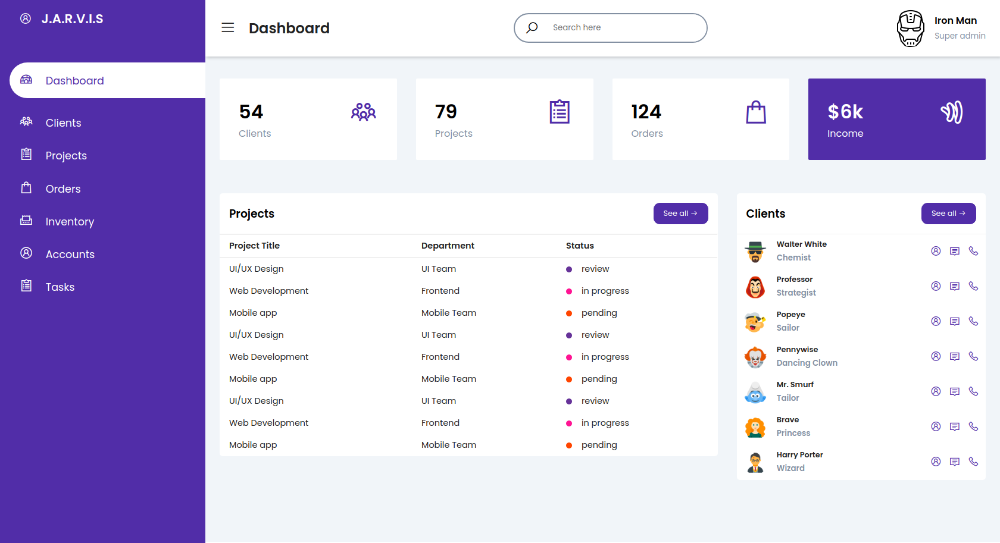

# Dashboard Template

> This is a fully responsive dashboard template built with HTML5 & CSS3.

## Built With

- HTML5
- CSS3
- [Line Awesome](https://icons8.com/line-awesome)

## Live Demo

[Live Demo Link](https://trekab.github.io/dashboard-template/)

## Getting Started

To get a local copy up and running follow these simple example steps.

To get a local copy up and running follow these simple example steps.
- `git clone git@github.com:trekab/dashboard-template.git`

Then you browse to the folder and exucute the following commands
- `cd dashboard-template`
- open the `index.html` file in your browser.

## Authors

👤 **Treasure Kabareebe**

- Github: [@trekab](https://github.com/trekab)
- Twitter: [@TKabareebe](https://twitter.com/TKabareebe)
- Linkedin: [Treasure Kabareebe](https://www.linkedin.com/in/treasure-kabareebe/)

## 🤝 Contributing

Contributions, issues and feature requests are welcome!

Feel free to check the [issues page](issues/).

## Show your support

Give a ⭐️ if you like this project!

## Acknowledgments

- [Responsive Admin Dashboard Page HTML And CSS](https://www.youtube.com/watch?v=OJEQaVT45XA&t=1195s)

## 📝 License

This project is [MIT](lic.url) licensed.
